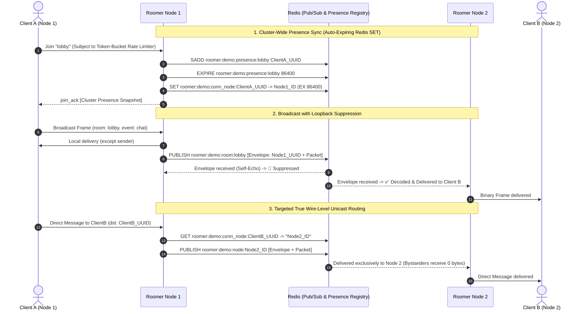

# Roomer

[](https://developer.mozilla.org/en-US/docs/Web/JavaScript)
[](https://www.typescriptlang.org/)
[](https://www.python.org/)
[](https://go.dev/)
[-DEA584?style=flat&logo=rust&logoColor=white)](https://www.rust-lang.org/)
[](https://nodejs.org/)
[](https://developer.mozilla.org/en-US/docs/Web/API/WebSockets_API)
[](./spec/roomer.tla)
[]()
[](./LICENSE)

Roomer is a high-throughput, room-based WebSocket framework engineered with zero client runtime dependencies, 12-byte zero-copy binary wire framing, multi-node horizontal clustering (Redis Pub/Sub with wire-level isolated $O(1)$ unicast routing and auto-expiring SET presence synchronization), connection token-bucket control-plane rate limiting, and mathematically verified state invariants (TLA+).

---

## 🏛️ Repository Layout & Scopes

| Directory | Scope & Purpose |
|---|---|
| **`client/`** | Zero-dependency JavaScript / TypeScript client (`roomer.js`, `bytecursor.js`, `emitter.js`). Provides Crockfordian functional encapsulation, binary framing, and exponential reconnection. |
| **`client/python/`** | Asynchronous Python client SDK (`roomer.py`, `pyproject.toml`). Built for `asyncio` with native binary packing via `struct.pack_into()`, event emitters, and context managers. |
| **`server/go/`** | Production Go server implementation (Go 1.26+, 32-shard FNV-1a lock striping with 64B cache line padding, token-bucket control-plane rate limiter, Redis SET presence adapter). |
| **`server/rust/`** | Production Rust server implementation (Rust 1.88+ / Edition 2024, Axum 0.8, Tokio, `DashMap` concurrency with 64B cache alignment, token-bucket rate limiting, zero-copy `bytes::Bytes` framing). |
| **`server/node/`** | Production Node.js server implementation (Node 22+, Crockfordian functional encapsulation, single-allocation binary framing, token-bucket control-plane rate limiter, Redis SET adapter). |
| **`spec/`** | Formal TLA+ specification (`roomer.tla`, `roomer.cfg`) verifying safety invariants, token-bucket rate limits, and room membership state machines. |
| **`examples/`** | Unified cross-platform HTML/JS frontend demonstration and interactive room client. |
| **`tests/`** | Automated browser-based test suite verifying packet encoding, event emission, exception filtering, and teardown. |

---

## ⚡ Key Architectural Features

- **Optimized 12-Byte Binary Wire Framing**: Packets start with a 2-byte `[1B Version][1B Flags]` header followed by right-sized Big-Endian length prefixes (Room/Event `uint16`, Dst/Src `uint8`, Payload `uint32`), reducing base header overhead to only 12 bytes.
- **Triple Server Parity**: Go, Rust, and Node.js implementations share the exact binary wire protocol, Redis envelope format, and loopback suppression contract.
- **Dual Client Ecosystem**: Native client SDKs in JavaScript/TypeScript (Browser, Node, Bun, Deno) and Python (`asyncio`).
- **Token-Bucket Control-Plane Rate Limiting**: Every connection enforces token-bucket rate limiting on `join` and `leave` control-plane operations to protect Redis and memory from command storms.
- **False Sharing Elimination**: Shards and metrics structs are padded and aligned to 64-byte L1/L2 CPU cache lines (in Go and Rust) to prevent cross-core cache invalidations.
- **True Wire-Level Unicast Routing**: Cluster nodes publish broadcasts to `prefix:room:*` channels while direct point-to-point frames travel over dedicated `prefix:node:<nodeID>` channels, preventing bystander nodes from receiving unicast traffic over the wire.
- **Cluster-Wide Presence with Auto-Expiring Sets**: Distributed Redis SET presence (`SADD`, `SREM`, `SMEMBERS`) with key-level TTL expiration on `AddPresence` eliminates heartbeat-touching overhead while automatically pruning abandoned rooms on server crash.
- **Configurable Backpressure Policies**: Supports `DropSlowClient` (default memory protection), `DropOldest` (queue eviction), and `DropNewest` buffer management.
- **Early Size Guarding**: Max message size validation executes before allocating or buffering frame bodies to prevent malicious memory allocation attacks.
- **Formally Verified (TLA+)**: Proven state invariants prevent disconnected zombie members, buffer leaks, and wire contract violations.
- **Ultra-High Throughput**: Capable of delivering **>2.6 million messages/second** in Go/Rust and **>260,000 messages/second** in Node.js clustered deployments with sub-millisecond fanout latency.

---

## 📐 Wire Protocol & Binary Framing

All messages (client $\leftrightarrow$ server and server $\leftrightarrow$ server) share a contiguous, big-endian binary frame with only **12 bytes** of base header overhead:

```text
+--------+-------+---------------+---------------+---------------+---------------+------------+-------------+------------+-------------+----------------+-------------------+
| 1B Ver | 1B Flg| 2B room_len   | room (UTF-8)  | 2B event_len  | event (UTF-8) | 1B dst_len | dst (UTF-8) | 1B src_len | src (UTF-8) | 4B payload_len | payload (binary)  |
+--------+-------+---------------+---------------+---------------+---------------+------------+-------------+------------+-------------+----------------+-------------------+
```

### Field Specifications
| Field | Type | Size | Description |
|---|---|---|---|
| `version` | `uint8` | 1 Byte | Protocol version (current: `0x01`). |
| `flags` | `uint8` | 1 Byte | Bitfield flags reserved for compression, encryption, or fragmentation (default: `0x00`). |
| `room_len` | `uint16` | 2 Bytes (BE) | Byte length of room channel name (0 to 65,535). |
| `room` | UTF-8 | Variable | Room channel name bytes. |
| `event_len` | `uint16` | 2 Bytes (BE) | Byte length of event descriptor (0 to 65,535). |
| `event` | UTF-8 | Variable | Event descriptor bytes. |
| `dst_len` | `uint8` | 1 Byte | Byte length of destination connection UUID (0 to 255). |
| `dst` | UTF-8 | Variable | Destination client ID string (empty for room broadcast). |
| `src_len` | `uint8` | 1 Byte | Byte length of sender connection UUID (0 to 255). |
| `src` | UTF-8 | Variable | Origin client ID string. |
| `payload_len` | `uint32` | 4 Bytes (BE) | Byte length of binary payload. |
| `payload` | Binary | Variable | Raw message payload data. |

### Example Frame (34 Bytes Total)
```text
Field         Value                   Wire Encoding (Big-Endian Hex)
--------------------------------------------------------------------
version       1                       01
flags         0                       00
room          "lobby"                 00 05        6c 6f 62 62 79
event         "chat"                  00 04        63 68 61 74
dst           "" (broadcast)          00
src           "user-123"              08           75 73 65 72 2d 31 32 33
payload       "Hello"                 00 00 00 05  48 65 6c 6c 6f
```

### Protocol-Reserved Event Names
The following event names are managed internally by the roomer protocol and cannot be sent directly via `.send()`:
- `"join"`, `"leave"`: Membership subscription requests.
- `"join_ack"`, `"leave_ack"`: Subscription acknowledgments containing member snapshots.
- `"new_member"`, `"member_left"`: Real-time presence notifications.
- `"open"`, `"close"`: Connection and room lifecycle events.

---

## 🌐 Distributed Clustering Architecture



---

## 📚 Client APIs

### 1. JavaScript / TypeScript Client (`client/roomer.js`)
Zero runtime dependencies. Written in Crockfordian functional JavaScript with complete TypeScript definitions.

```javascript
import roomer from "./client/roomer.js";

// Connect and auto-join the global "root" room
const root = roomer("ws://localhost:8080/ws", { reconnect: true });

root.on("open", () => {
    console.log("Connected to root room! Client ID:", root.id());

    const lobby = root.join("lobby");

    lobby.on("open", () => {
        console.log("Joined lobby! Active members:", lobby.members());
        lobby.send("chat", "Hello from JS!");
    });

    lobby.on("chat", (payload, senderId) => {
        const text = new TextDecoder().decode(payload);
        console.log(`[${senderId}]: ${text}`);
    });
});

// Explicitly close all rooms and disconnect
// root.close();
```

---

### 2. Python Client (`client/python/roomer.py`)
Async client engineered for Python 3.10+ and `asyncio` applications with pre-allocated `bytearray` and `struct.pack_into()` framing.

```python
import asyncio
from roomer import roomer

async def main():
    async with roomer("ws://localhost:8080/ws") as root:
        print(f"Connected to root room! Client ID: {root.id}")

        lobby = root.join("lobby")

        @lobby.on("open")
        def on_open():
            print(f"Joined lobby! Active members: {lobby.members()}")
            lobby.send("chat", "Hello from Python!")

        @lobby.on("chat")
        def on_chat(payload: bytes, sender_id: str):
            print(f"[{sender_id}]: {payload.decode('utf-8')}")

        await asyncio.Event().wait()

if __name__ == "__main__":
    asyncio.run(main())
```

---

### `Room` Instance Methods
| Method (JS) | Method (Python) | Description |
|---|---|---|
| `.id()` | `.id` | Connection UUID assigned by the server. |
| `.open()` | `.is_open` | `True` if room membership is currently active. |
| `.members()` | `.members()` | Shallow copy array/list of all active member IDs in this room. |
| `.join(roomName)` | `.join(room_name)` | Subscribes to a room channel over the existing connection (rate-limited). |
| `.leave()` | `.leave()` | Unsubscribes from the room and notifies the cluster (rate-limited). |
| `.send(event, payload?, dst?)` | `.send(event, payload=None, dst="")` | Sends a message packet (broadcast to room, or direct to `dst`). |
| `.clearListeners([exceptions])`| `.clear_listeners(exceptions=None)` | Clears registered listeners except those listed in `exceptions`. |
| `.forceClose(isDisconnect?)` | `.force_close(is_disconnect=False)` | Closes room state locally and emits `"close"`. |
| `.close()` *(root only)* | `.close()` *(root only)* | Explicitly tears down the WebSocket connection and closes all active rooms. |
| `.purge()` *(root only)* | `.purge()` *(root only)* | Leaves all non-root rooms simultaneously. |
| `.rooms()` *(root only)* | `.rooms()` *(root only)* | Read-only map/dict of all active room instances. |

---

## 🚀 Server Implementations

| Server | Documentation | Concurrency Engine | Clustering Engine |
|---|---|---|---|
| **Go** | [`server/go/README.md`](./server/go/README.md) | Go 1.26, 32-Shard FNV-1a Lock Striping with 64B Padding, Token-Bucket Rate Limiter | `go-redis/v9` UniversalClient (SET Presence) |
| **Rust** | [`server/rust/README.md`](./server/rust/README.md) | Rust 1.88 (2024), Axum 0.8, Tokio, `DashMap` with 64B Cache Alignment, Token-Bucket Rate Limiter | `redis 0.27` Tokio Multiplexer (SET Presence) |
| **Node.js** | [`server/node/README.md`](./server/node/README.md) | Node 22+, Functional Closures, `ws`, Token-Bucket Rate Limiter, Libuv Stream Backpressure | `ioredis 5.4` Pub/Sub & SET Presence |

---

## 🧪 Testing & Verification

The project provides a unified automation runner via `make`. Run `make help` to inspect the full palette of targets and configuration flags:

```bash
make help
```

```text
Roomer Development & Testing Automation:

  Testing & Quality Assurance
    test             Run all unit test suites across Go, Rust, Node, and Python
    test-go          Run Go unit tests with race detector
    test-rust        Run Rust server unit and integration tests
    test-node        Run Node.js server test suite
    test-python      Run Python client SDK test suite
    check            Run TLA+ formal specification model checking suite
    tla              Verify formal state invariants in spec/roomer.tla with TLC

  Clustering & Load Testing
    cluster          Start multi-node Redis cluster with PAIR (default: PAIR=go-rust)
    cluster-up       Alias for 'cluster'
    cluster-down     Stop and tear down multi-node cluster containers
    cluster-test     Orchestrate cluster spinup, readiness wait, load test, and teardown
    loadtest         Run cluster load test (CLIENTS=50 MESSAGES=500 DELAY=0)

  Infrastructure & Utilities
    redis            Start standalone Redis container on port 6379
    redis-up         Alias for 'redis'
    redis-down       Stop standalone Redis container
    tla-download     Download tla2tools.jar into repository root
    help             Display this help guide with available targets

  Configurable Variables
    PAIR            Cluster server pair (default: go-rust; options: rust-go, go-node, rust-node)
    CLIENTS         Clients per cluster node for loadtest (default: 50)
    MESSAGES        Broadcast messages to send in loadtest (default: 500)
    DELAY           Microseconds between messages in loadtest (default: 0)
    NODE1_URL       WebSocket URL for Node 1 (default: ws://localhost:8080/ws)
    NODE2_URL       WebSocket URL for Node 2 (default: ws://localhost:8081/ws)
    NODES           Comma-separated node URLs (overrides NODE1_URL and NODE2_URL)
    ROOM            Target room name for loadtest (default: unique timestamped room)
    PYTEST          Python test runner path (auto-detects client/python/.venv)
```

---

### 1. Unit & Language Test Suites

Run individual or combined language suites with zero overhead:

```bash
# Run all language test suites (Go, Rust, Node, Python):
make test

# Run isolated language test suites:
make test-go       # Go tests with race detection (-race)
make test-rust     # Rust Cargo test suite with redis-adapter feature
make test-node     # Node.js test runner (node --test)
make test-python   # Python pytest suite (auto-detects virtualenv)
```

---

### 2. Multi-Node Cluster Load Testing

Run automated cross-language cluster integration tests where clients publish and subscribe across heterogeneous servers bridged by Redis:

```bash
# Automated cross-server orchestration via Makefile (builds, starts, tests, tears down):
make cluster-test

# Test heterogeneous cluster pairs (e.g. Rust on 8080, Go on 8081):
PAIR=rust-go make cluster-test
PAIR=go-node make cluster-test
PAIR=rust-node make cluster-test

# Orchestrate cluster load tests with custom client and message volumes:
CLIENTS=100 MESSAGES=1000 make cluster-test

# Or manage the cluster lifecycle manually:
make cluster-up                      # Spin up cluster containers (default: go-rust)
make loadtest                        # Execute load test against 8080 and 8081
make cluster-down                    # Tear down cluster containers

# Execute customized load test runs against active cluster:
make loadtest CLIENTS=100 MESSAGES=2000 DELAY=50
make loadtest NODES="ws://localhost:8080/ws,ws://localhost:8081/ws,ws://localhost:8082/ws"

# Or manually start individual single-language cluster setups:
docker compose -f server/node/docker-compose.yml up --build -d
# OR
docker compose -f server/rust/docker-compose.yml up --build -d
# OR
docker compose -f server/go/docker-compose.yml up --build -d

# Standalone Go loadtest CLI command:
go run ./server/go/cmd/loadtest/main.go -node1=ws://localhost:8080/ws -node2=ws://localhost:8081/ws -clients=100 -messages=2000

# Tear down cluster (replace {server} with go, rust, or node)
docker compose -f server/{server}/docker-compose.yml down
```

---

### 3. Browser Test Suite & Interactive Demo

Start any server implementation and open the automated browser test runner:

```bash
# Start any server:
go run ./server/go/examples/main.go
# OR
cargo run --manifest-path server/rust/Cargo.toml --example server
# OR
cd server/node && npm start
```
- **Interactive Chat Demo:** [http://localhost:8080/](http://localhost:8080/)
- **Automated Browser Test Suite:** [http://localhost:8080/tests/](http://localhost:8080/tests/)

---

### 4. Formal Verification (TLA+)

The formal TLA+ model specification (`spec/roomer.tla` and `spec/roomer.cfg`) mathematically verifies safety invariants against race conditions and protocol violations:
- `TypeOK`: Type consistency across connection registries, presence sets, and buffers.
- `NoUnconnectedMembers`: Proves disconnected clients can never remain active in room presence.
- `NotConnectedBufferEmpty`: Proves disconnected clients never hold unconsumed buffer state.
- `WireFormatValid`: Proves every frame matches the 12-byte header wire format.

```bash
# Run formal verification via Makefile (auto-detects 'tlc', ~/.tla/tla2tools.jar, or local jar):
make check
# (or 'make tla')

# Download tla2tools.jar directly if TLC is not installed on your system:
make tla-download

# Or run directly using the TLC CLI / Java:
tlc -config spec/roomer.cfg spec/roomer.tla
# OR
java -cp ~/.tla/tla2tools.jar tlc2.TLC -config spec/roomer.cfg spec/roomer.tla
```

---

## 📄 License

Roomer is open-source software licensed under the [MIT License](./LICENSE).
