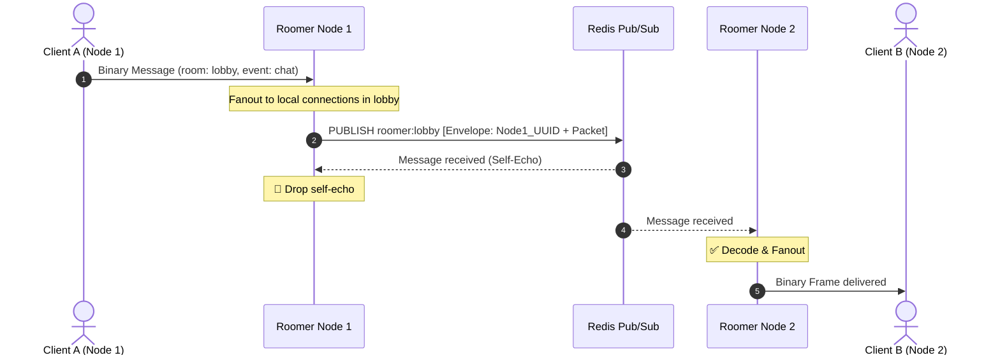
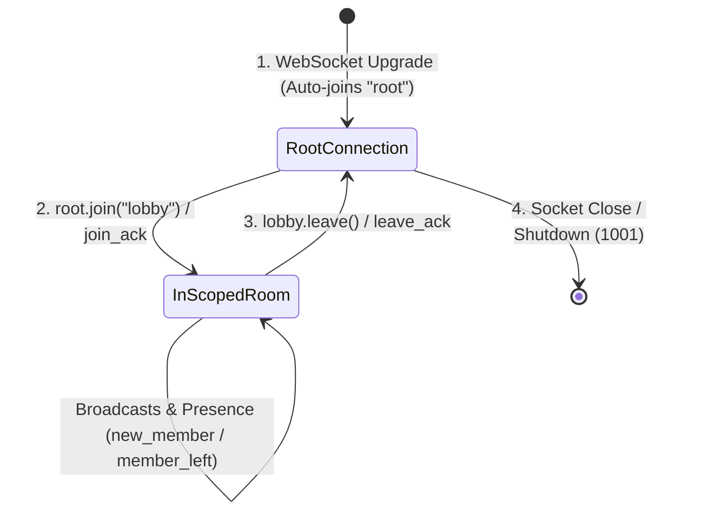

# Roomer

[](https://developer.mozilla.org/en-US/docs/Web/JavaScript)
[](https://www.typescriptlang.org/)
[](https://developer.mozilla.org/en-US/docs/Web/API/WebSockets_API)
[](./spec/roomer.tla)
[]()
[](./LICENSE)

Roomer is a high-throughput, room-based WebSocket framework with zero client dependencies, zero-copy binary framing, multi-node horizontal clustering (Redis Pub/Sub), and formally verified state invariants (TLA+).

## Repository Layout

- **`client/`**: Zero-dependency JavaScript / TypeScript client (`roomer.js`, `bytecursor.js`, `emitter.js`).
- **`server/go/`**: Go server implementation (Go 1.21+, lock-striped sharding).
- **`server/rust/`**: Rust server implementation (Axum 0.8+, Tokio, lock-striped DashMap).
- **`spec/`**: Formal TLA+ specification (`roomer.tla`) proving state safety and room membership invariants.
- **`examples/`**: Unified frontend interactive demo.
- **`tests/`**: Unified browser test suite.

---

## 🏛️ Architecture & Wire Protocol

### 1. Zero-Copy Binary Framing
Every packet is serialized into 5 big-endian, length-prefixed fields (20-byte header overhead):

```
+---------------+---------------+---------------+---------------+---------------+---------------+---------------+---------------+---------------+-------------------+
| 4B room_len   | room (UTF-8)  | 4B event_len  | event (UTF-8) | 4B dst_len    | dst (UTF-8)   | 4B src_len    | src (UTF-8)   | 4B payload_len| payload (binary)  |
+---------------+---------------+---------------+---------------+---------------+---------------+---------------+---------------+---------------+-------------------+
```

#### Example Frame (39 bytes total)
```
Field         Value                   Length Prefix
---------------------------------------------------
room          "lobby"                 00 00 00 05 (5B)
event         "chat"                  00 00 00 04 (4B)
dst           "" (broadcast)          00 00 00 00 (0B)
src           "user-123"              00 00 00 08 (8B)
payload       "Hello"                 00 00 00 05 (5B)
```

### 2. Multi-Node Clustering with Loopback Suppression
When scaling across multiple instances, nodes publish to Redis channels prefixed by room name. Messages are wrapped in a binary node envelope (`[4B node_id_len][node_id][packet]`). The originating node filters out its own messages:



### 3. Room & Connection Lifecycle


---

## 📚 Client API (`client/roomer.js`)

### Initialization
```typescript
import roomer from "./client/roomer.js";

const root = roomer("ws://localhost:8080/ws", {
    reconnect: true,     // Default: true
    initial_delay: 500,  // Default: 500ms
    max_delay: 5000      // Default: 5000ms
});
```

### `Room` Methods
| Method | Returns | Description |
|---|---|---|
| `.id()` | `string` | Assigned connection UUID string. |
| `.open()` | `boolean` | `true` if room membership is active. |
| `.members()` | `string[]` | Shallow copy array of active member IDs in this room. |
| `.join(name)` | `Room` | Joins a room channel over the same connection. |
| `.leave()` | `Room` | Leaves the room and notifies the server. |
| `.send(event, payload?, dst?)` | `Room` | Sends message packet (broadcast or direct to `dst`). |
| `.clearListeners([exceptions])` | `Room` | Removes event listeners except those listed in `exceptions`. |
| `.forceClose(is_disconnect?)` | `Room` | Closes room locally and emits `"close"`. |
| `.purge()` *(root only)* | `Room` | Leaves all non-root rooms simultaneously. |
| `.rooms()` *(root only)* | `Record<string, Room>` | Map of active room instances. |

### Reserved Protocol Events
The following event names cannot be sent directly via `.send()`:
`"join"`, `"leave"`, `"join_ack"`, `"leave_ack"`, `"new_member"`, `"member_left"`, `"open"`, `"close"`.

---

## 🚀 Server Implementations

- [Go Server Documentation](./server/go/README.md)
- [Rust Server Documentation](./server/rust/README.md)
- [TLA+ Formal Specification](./spec/roomer.tla)
