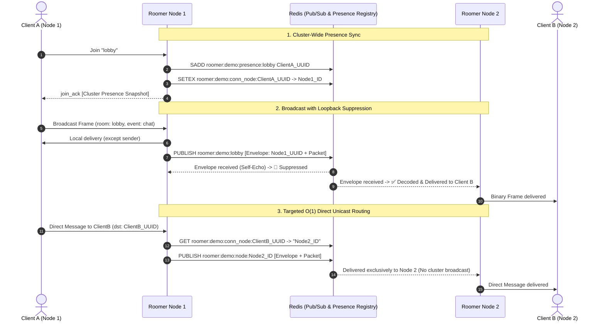

# Roomer

[](https://developer.mozilla.org/en-US/docs/Web/JavaScript)
[](https://www.typescriptlang.org/)
[](https://www.python.org/)
[](https://go.dev/)
[-DEA584?style=flat&logo=rust&logoColor=white)](https://www.rust-lang.org/)
[](https://nodejs.org/)
[](https://developer.mozilla.org/en-US/docs/Web/API/WebSockets_API)
[](./spec/roomer.tla)
[]()
[](./LICENSE)

Roomer is a high-throughput, room-based WebSocket framework engineered with zero client runtime dependencies, zero-copy binary framing, multi-node horizontal clustering (Redis Pub/Sub with $O(1)$ unicast direct routing and cluster-wide presence synchronization), and mathematically verified state invariants (TLA+).

---

## 🏛️ Repository Layout & Scopes

| Directory | Scope & Purpose |
|---|---|
| **`client/`** | Zero-dependency JavaScript / TypeScript client (`roomer.js`, `bytecursor.js`, `emitter.js`). Provides Crockfordian functional encapsulation, binary framing, and exponential reconnection. |
| **`client/python/`** | Asynchronous Python client SDK (`roomer.py`, `pyproject.toml`). Built for `asyncio` with native binary packing, event emitters, and context managers. |
| **`server/go/`** | Production Go server implementation (Go 1.26+, 32-shard FNV-1a lock striping, configurable backpressure, Redis adapter). |
| **`server/rust/`** | Production Rust server implementation (Rust 1.88+ / Edition 2024, Axum 0.8, Tokio, `DashMap` concurrency, zero-copy `bytes::Bytes` framing). |
| **`server/node/`** | Production Node.js server implementation (Node 24+, Crockfordian functional encapsulation, single-allocation binary framing, Redis adapter). |
| **`spec/`** | Formal TLA+ specification (`roomer.tla`, `roomer.cfg`) verifying safety invariants and room membership state machines. |
| **`examples/`** | Unified cross-platform HTML/JS frontend demonstration and interactive room client. |
| **`tests/`** | Automated browser-based test suite verifying packet encoding, event emission, exception filtering, and teardown. |

---

## ⚡ Key Architectural Features

- **Zero-Copy Binary Wire Framing**: Every packet is packed into 5 big-endian, length-prefixed fields with only 20 bytes of header overhead.
- **Triple Server Parity**: Go, Rust, and Node.js implementations share the exact binary wire protocol, Redis envelope format, and loopback suppression contract.
- **Dual Client Ecosystem**: Native client SDKs in JavaScript/TypeScript (Browser, Node, Bun, Deno) and Python (`asyncio`).
- **Horizontal Scaling with $O(1)$ Unicast Routing**: Cluster nodes publish broadcasts to room channels while routing direct point-to-point messages directly to the target host node.
- **Cluster-Wide Presence Synchronization**: Distributed presence sets guarantee `join_ack` snapshots return every active room member across all nodes in the cluster.
- **Configurable Backpressure Policies**: Supports `DropSlowClient` (default memory protection), `DropOldest` (queue eviction), and `DropNewest` buffer management.
- **Formally Verified (TLA+)**: Proven state invariants prevent disconnected zombie members and buffer leaks.
- **Ultra-High Throughput**: Capable of delivering **>1.4 million messages/second** in Go/Rust and **>326,000 messages/second** in Node.js clustered deployments with sub-millisecond fanout latency.

---

## 📐 Wire Protocol & Binary Framing

All messages (client $\leftrightarrow$ server and server $\leftrightarrow$ server) share a contiguous, big-endian binary frame:

```text
+---------------+---------------+---------------+---------------+---------------+---------------+---------------+---------------+---------------+-------------------+
| 4B room_len   | room (UTF-8)  | 4B event_len  | event (UTF-8) | 4B dst_len    | dst (UTF-8)   | 4B src_len    | src (UTF-8)   | 4B payload_len| payload (binary)  |
+---------------+---------------+---------------+---------------+---------------+---------------+---------------+---------------+---------------+-------------------+
```

### Example Frame (39 Bytes Total)
```text
Field         Value                   Wire Encoding (Big-Endian Hex)
--------------------------------------------------------------------
room          "lobby"                 00 00 00 05  6c 6f 62 62 79
event         "chat"                  00 00 00 04  63 68 61 74
dst           "" (broadcast)          00 00 00 00
src           "user-123"              00 00 00 08  75 73 65 72 2d 31 32 33
payload       "Hello"                 00 00 00 05  48 65 6c 6c 6f
```

### Protocol-Reserved Event Names
The following event names are managed internally by the roomer protocol and cannot be sent directly via `.send()`:
- `"join"`, `"leave"`: Membership subscription requests.
- `"join_ack"`, `"leave_ack"`: Subscription acknowledgments containing member snapshots.
- `"new_member"`, `"member_left"`: Real-time presence notifications.
- `"open"`, `"close"`: Connection and room lifecycle events.

---

## 🌐 Distributed Clustering Architecture



---

## 📚 Client APIs

### 1. JavaScript / TypeScript Client (`client/roomer.js`)
Zero runtime dependencies. Written in Crockfordian functional JavaScript with complete TypeScript definitions.

```javascript
import roomer from "./client/roomer.js";

// Connect and auto-join the global "root" room
const root = roomer("ws://localhost:8080/ws", { reconnect: true });

root.on("open", () => {
    console.log("Connected to root room! Client ID:", root.id());

    const lobby = root.join("lobby");

    lobby.on("open", () => {
        console.log("Joined lobby! Active members:", lobby.members());
        lobby.send("chat", "Hello from JS!");
    });

    lobby.on("chat", (payload, senderId) => {
        const text = new TextDecoder().decode(payload);
        console.log(`[${senderId}]: ${text}`);
    });
});
```

---

### 2. Python Client (`client/python/roomer.py`)
Async client engineered for Python 3.10+ and `asyncio` applications, FastAPI backends, and AI streaming workers.

```python
import asyncio
from roomer import roomer

async def main():
    async with roomer("ws://localhost:8080/ws") as root:
        print(f"Connected to root room! Client ID: {root.id}")

        lobby = root.join("lobby")

        @lobby.on("open")
        def on_open():
            print(f"Joined lobby! Active members: {lobby.members()}")
            lobby.send("chat", "Hello from Python!")

        @lobby.on("chat")
        def on_chat(payload: bytes, sender_id: str):
            print(f"[{sender_id}]: {payload.decode('utf-8')}")

        await asyncio.Event().wait()

if __name__ == "__main__":
    asyncio.run(main())
```

---

### `Room` Instance Methods
| Method (JS) | Method (Python) | Description |
|---|---|---|
| `.id()` | `.id` | Connection UUID assigned by the server. |
| `.open()` | `.is_open` | `True` if room membership is currently active. |
| `.members()` | `.members()` | Shallow copy array/list of all active member IDs in this room. |
| `.join(roomName)` | `.join(room_name)` | Subscribes to a room channel over the existing connection. |
| `.leave()` | `.leave()` | Unsubscribes from the room and notifies the cluster. |
| `.send(event, payload?, dst?)` | `.send(event, payload=None, dst="")` | Sends a message packet (broadcast to room, or direct to `dst`). |
| `.clearListeners([exceptions])`| `.clear_listeners(exceptions=None)` | Clears registered listeners except those listed in `exceptions`. |
| `.forceClose(isDisconnect?)` | `.force_close(is_disconnect=False)` | Closes room state locally and emits `"close"`. |
| `.purge()` *(root only)* | `.purge()` *(root only)* | Leaves all non-root rooms simultaneously. |
| `.rooms()` *(root only)* | `.rooms()` *(root only)* | Read-only map/dict of all active room instances. |

---

## 🚀 Server Implementations

| Server | Documentation | Concurrency Engine | Clustering Engine |
|---|---|---|---|
| **Go** | [`server/go/README.md`](./server/go/README.md) | Go 1.26, 32-Shard FNV-1a Lock Striping, Channels | `go-redis/v9` UniversalClient |
| **Rust** | [`server/rust/README.md`](./server/rust/README.md) | Rust 1.88 (2024), Axum 0.8, Tokio, `DashMap` | `redis 0.27` Tokio Connection Multiplexer |
| **Node.js** | [`server/node/README.md`](./server/node/README.md) | Node 24+, Functional Closures, `ws`, Libuv Stream Backpressure | `ioredis 5.4` Pub/Sub & Presence Registry |

---

## 🧪 Testing & Verification

### 1. Browser Test Suite & Interactive Demo
```bash
# Start any server:
go run ./server/go/examples/main.go
# OR
cargo run --manifest-path server/rust/Cargo.toml --example server
# OR
cd server/node && npm start
```
- **Interactive Chat Demo:** [http://localhost:8080/](http://localhost:8080/)
- **Automated Browser Test Suite:** [http://localhost:8080/tests/](http://localhost:8080/tests/)

### 2. Multi-Node Cluster Load Testing
```bash
# Start 2-node cluster with Redis
docker compose -f server/node/docker-compose.yml up --build -d
# OR
docker compose -f server/rust/docker-compose.yml up --build -d
# OR
docker compose -f server/go/docker-compose.yml up --build -d

# Run cluster load test (1,000 broadcasts across 100 clients)
go run ./server/go/cmd/loadtest/main.go -node1=ws://localhost:8080/ws -node2=ws://localhost:8081/ws

# Tear down cluster
docker compose -f server/node/docker-compose.yml down
```

### 3. Unit, Race Detector & Benchmark Commands
```bash
# Go unit tests, race detector, and memory benchmarks
go test -v -race ./server/go/...
go test -bench=. -benchmem ./server/go/...

# Rust unit tests, proptest fuzzing, and Criterion benchmarks
cargo test --manifest-path server/rust/Cargo.toml --all-targets --features redis-adapter
cargo bench --manifest-path server/rust/Cargo.toml --features redis-adapter

# Node.js unit and stress tests
cd server/node && npm test

# Python client test suite
cd client/python && pytest -v
```

### 4. Formal Verification (TLA+)
The state-safety invariants (`NoUnconnectedMembers`, `NotConnectedBufferEmpty`, and `TypeOK`) are formally specified in `spec/roomer.tla`:

```bash
# Using the tlc command line utility:
tlc -config spec/roomer.cfg spec/roomer.tla

# OR using tla2tools.jar directly:
java -cp tla2tools.jar tlc2.TLC -config spec/roomer.cfg spec/roomer.tla
```

---

## 📄 License

Roomer is open-source software licensed under the [MIT License](./LICENSE).
