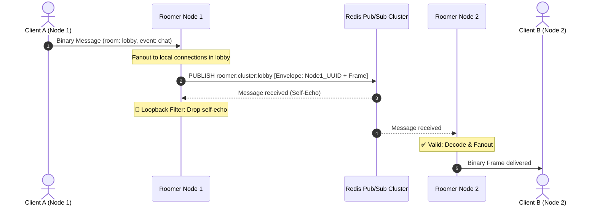
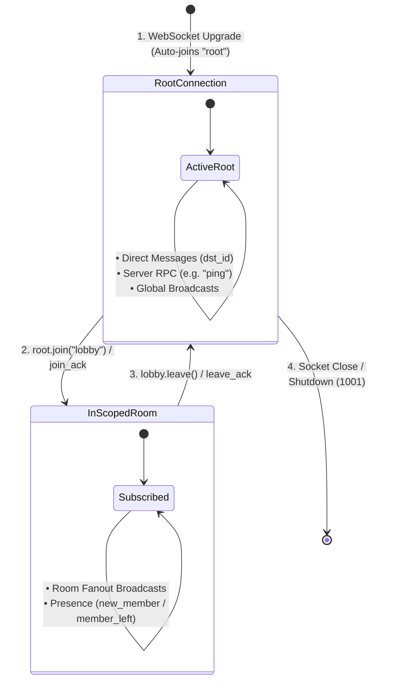

# `roomer-go` – Room-Based WebSocket Framework

[](https://pkg.go.dev/github.com/joncody/roomer-go-go)
[](https://golang.org/)
[](https://developer.mozilla.org/en-US/docs/Web/JavaScript)
[](https://www.typescriptlang.org/)
[](https://developer.mozilla.org/en-US/docs/Web/API/WebSockets_API)
[](./spec/roomer.tla)
[]()
[](./LICENSE)

> 🦀 **Looking for the Rust implementation?** Check out [`roomer` (Rust)](https://github.com/joncody/roomer-go). Both implementations share the identical binary wire protocol and work interchangeably with the zero-dependency client.

A lightweight, enterprise-grade WebSocket framework for real-time applications written in **Go** (server) and **JavaScript / TypeScript** (client). Built around **rooms**, **binary packet framing**, and **lock-striped concurrency**, `roomer` handles connection lifecycles, horizontal clustering, observability, and concurrency with first-principles systems design.

> 📦 **Zero client dependencies** • ⚡ **Zero-copy binary framing** • 🌐 **Multi-node clustering** • 🌲 **Formal TLA+ spec**

---

## 🏛️ Visual Architecture

### 1. Wire Protocol: Zero-Copy Binary Framing
Every message packet is packed into big-endian, length-prefixed binary fields:

```
+---------------+---------------+---------------+---------------+---------------+---------------+---------------+---------------+---------------+-------------------+
| 4B room_len   | room (UTF-8)  | 4B event_len  | event (UTF-8) | 4B dst_len    | dst (UTF-8)   | 4B src_len    | src (UTF-8)   | 4B payload_len| payload (binary)  |
+---------------+---------------+---------------+---------------+---------------+---------------+---------------+---------------+---------------+-------------------+
```

### 2. Multi-Node Cluster Scaling with Loopback Suppression
When scaling across multiple server instances behind a load balancer, instances communicate over Redis Pub/Sub channels. Binary node envelopes tag each message with its source node ID to filter self-echoes instantly at the subscriber boundary:



### 3. Client Connection & Dynamic Room Lifecycle


---

## ✅ Key Features

- 🏢 **Automatic Room Management:** Create, join, and leave rooms dynamically with automatic empty-room cleanup.
- ⚡ **Zero-Copy Binary Protocol:** Uses length-prefixed fields with direct slice decoding and single-allocation packet serialization for ultra-low latency.
- 🌐 **Pluggable Cluster Scaling (`Adapter`):** Multi-node horizontal scaling support across Redis pub/sub clusters with a zero-dependency in-memory default.
- 🔁 **Built-in Loopback Suppression:** Distributed adapters filter node self-echoes with binary node envelopes to guarantee clients never receive duplicate messages.
- 📊 **Production Observability (`Metrics`):** Telemetry hooks for Prometheus and OpenTelemetry instrumenting connections, room counts, byte throughput, and drop events.
- 🪵 **Structured Logging (`log/slog`):** Integrated with Go 1.21+ structured logging with configurable handlers and log levels.
- 🛑 **Graceful Draining & Shutdown:** Package-level `Shutdown(ctx)` flushes queues, sends WebSocket `1001 Going Away` close frames, and cleans up active connections within deadline contexts.
- 🔒 **Lock-Striped Sharding:** Hub connections and rooms are partitioned across 32 lock-striped shards via FNV-1a hashing to eliminate CPU core contention.
- 🚀 **On-Demand Room Fanout:** Direct non-blocking broadcasting without per-room background goroutines or channel queue bottlenecks.
- 🧩 **Handler Registration:** Register custom per-event server logic with `RegisterHandler` with automatic reserved-event guards.
- 🌐 **Single Root Connection:** Clients start in a `"root"` room and dynamically join and leave channels over a single WebSocket connection.
- 🧪 **Formal Verification:** Includes a TLA+ specification (`spec/roomer.tla`) proving state safety and room membership invariants.

---

## 📦 Installation

### Go Server
```bash
go get github.com/joncody/roomer-go-go
```
*Requires Go 1.21+.*

### Optional Redis Cluster Adapter
```bash
go get github.com/redis/go-redis/v9
```

### Frontend Client (Zero Dependencies)
Include these standalone files from `src/` in your frontend:
- `src/roomer.js` (and `src/roomer.d.ts` for TypeScript)
- `src/bytecursor.js` (and `src/bytecursor.d.ts`)
- `src/emitter.js` (and `src/emitter.d.ts`)

```javascript
import roomer from "./roomer.js";
```

---

## 🧠 Quick Start

### 1. Production Go Server with Graceful Shutdown & Telemetry
```go
package main

import (
	"context"
	"log/slog"
	"net/http"
	"os"
	"os/signal"
	"syscall"
	"time"

	"github.com/joncody/roomer-go-go"
)

func main() {
	logger := slog.New(slog.NewJSONHandler(os.Stdout, nil))

	// Register custom event handler
	err := roomer.RegisterHandler("ping", func(c *roomer.Conn, msg *roomer.Message) error {
		reply := roomer.NewTextMessage("util", "pong", "", c.ID, "pong")
		c.TrySend(reply.Bytes())
		return nil
	})
	if err != nil {
		logger.Error("Failed to register handler", "err", err)
		os.Exit(1)
	}

	// Mount WebSocket handler with production options
	http.HandleFunc("/ws", roomer.SocketHandlerWithOptions(
		roomer.WithLogger(logger),
		roomer.WithMaxMessageSize(8 * 1024 * 1024), // 8MB limit
	))

	server := &http.Server{Addr: ":8080"}

	// Graceful shutdown listener
	go func() {
		sigChan := make(chan os.Signal, 1)
		signal.Notify(sigChan, os.Interrupt, syscall.SIGTERM)
		<-sigChan

		logger.Info("Shutting down server...")
		shutdownCtx, cancel := context.WithTimeout(context.Background(), 5*time.Second)
		defer cancel()

		_ = roomer.Shutdown(shutdownCtx)
		_ = server.Shutdown(shutdownCtx)
	}()

	logger.Info("Server listening on :8080")
	if err := server.ListenAndServe(); err != http.ErrServerClosed {
		logger.Error("Server error", "err", err)
	}
}
```

### 2. Frontend Client (JavaScript / TypeScript)
```javascript
import roomer from "./roomer.js";

const decoder = new TextDecoder("utf-8");
const root = roomer("ws://localhost:8080/ws", { reconnect: true });

root.on("open", function () {
    console.log("Connected! My Client ID: " + root.id());

    const lobby = root.join("lobby");

    lobby.on("open", function () {
        lobby.send("ping", "hello");
    });

    lobby.on("pong", function (payload, sender_id) {
        console.log("Received pong from " + sender_id);
    });

    lobby.on("new_member", function (id) {
        console.log("User joined: " + id);
    });

    lobby.on("member_left", function (id) {
        console.log("User left: " + id);
    });
});
```

---

## 🌐 Horizontal Scaling (Multi-Node Clustering)

When scaling horizontally across multiple server instances behind a load balancer, import the Redis cluster adapter:

```go
package main

import (
	"log"
	"net/http"
	"time"

	"github.com/joncody/roomer-go-go"
	redisadapter "github.com/joncody/roomer-go-go/adapter/redis"
	"github.com/redis/go-redis/v9"
)

func main() {
	rdb := redis.NewClient(&redis.Options{
		Addr: "localhost:6379",
	})

	adapter, err := redisadapter.New(rdb,
		redisadapter.WithPrefix("roomer:prod:"),
		redisadapter.WithPublishTimeout(3 * time.Second),
	)
	if err != nil {
		log.Fatalf("Failed to init redis adapter: %v", err)
	}

	http.HandleFunc("/ws", roomer.SocketHandlerWithOptions(
		roomer.WithAdapter(adapter),
	))

	http.ListenAndServe(":8080", nil)
}
```

---

## 📚 Client API (`roomer.js` & `roomer.d.ts`)

### Initialization
```typescript
const root = roomer(url: string, options?: RoomerOptions): Room;
```

#### `RoomerOptions`
| Option | Type | Default | Description |
|---|---|---|---|
| `reconnect` | `boolean` | `true` | Enables auto-reconnect with exponential backoff and jitter on drop. |
| `initial_delay` | `number` | `500` | Initial reconnect delay in milliseconds. |
| `max_delay` | `number` | `5000` | Maximum reconnect backoff ceiling in milliseconds. |

### `Room` Methods
| Method | Description |
|---|---|
| `.id()` | Returns assigned client ID string. |
| `.open()` | `true` if room connection is open. |
| `.members()` | Returns copy array of current member IDs. |
| `.join(name)` | Joins another room on the same WebSocket connection. |
| `.leave()` | Leaves room and notifies server. |
| `.send(event, payload?, dst?)` | Sends message packet (to room or direct to `dst`). |
| `.clearListeners([exceptions])` | Removes event listeners except those in `exceptions`. |
| `.forceClose()` | Forcefully closes room locally and emits `"close"`. |
| `.purge()` *(root only)* | Leaves all non-root rooms simultaneously. |
| `.rooms()` *(root only)* | Returns dictionary of all active room instances. |

---

## 📚 Server API (`roomer` Go Package)

### Core Functions & Handlers
| Function | Description |
|---|---|
| `RegisterHandler(event string, handler MessageHandler)` | Registers a custom message handler. Rejects reserved events and duplicates. |
| `Shutdown(ctx context.Context) error` | Broadcasts `1001 Going Away` close frames to all connections and drains adapters within context deadline. |
| `SocketHandler(auth Authorize)` | Returns an `http.HandlerFunc` with default settings. |
| `SocketHandlerWithOptions(opts ...Option)` | Returns an `http.HandlerFunc` configured via functional options. |
| `ExtractBearerToken(r *http.Request)` | Extracts standard `Bearer <token>` from HTTP `Authorization` headers. |

### `*Conn` Methods & Fields
| Method / Field | Description |
|---|---|
| `c.ID` | Unique connection UUID string. |
| `c.Claims` | Map of authenticated claims (e.g., from JWT / HTTP request). |
| `c.SendToRoom(room, event string, payload []byte)` | Broadcasts to all room members **except sender**. |
| `c.SendToClient(dstID, event string, payload []byte)` | Sends direct message to another client ID. |
| `c.TrySend(msg []byte) bool` | Sends raw message to self (non-blocking; tears down slow clients asynchronously). |
| `c.IsInRoom(room string) bool` | Checks if connection is currently in a room. |

---

## 📐 Binary Protocol Specification

Packets are serialized as big-endian length-prefixed fields:

```
[4B room_len][room][4B event_len][event][4B dst_len][dst][4B src_len][src][4B payload_len][payload]
```

### Example Packet Walkthrough
A message sent to room `"lobby"` with event `"chat"` from user `"user-uuid"` with payload `"Hello"`:

```
Field         Hex / Bytes                            Length Prefix
------------------------------------------------------------------
room_len      00 00 00 05                            4 bytes
room          6c 6f 62 62 79 ("lobby")               5 bytes
event_len     00 00 00 04                            4 bytes
event         63 68 61 74    ("chat")                4 bytes
dst_len       00 00 00 00                            4 bytes
dst           (empty)                                0 bytes
src_len       00 00 00 09                            4 bytes
src           75 73 65 72 2d 75 75 69 64 ("user-uuid") 9 bytes
payload_len   00 00 00 05                            4 bytes
payload       48 65 6c 6c 6f ("Hello")               5 bytes
------------------------------------------------------------------
Total Wire Size: 39 bytes (Header overhead = exactly 20 bytes)
```

---

## 🛡️ Concurrency & Safety

- **32-Shard Lock Striping**: Hub state is partitioned into 32 distinct shards to distribute read/write locks across CPU cores under heavy concurrent traffic.
- **On-Demand Fanout**: Broadcasts iterate through members directly under reader locks without channel queuing overhead or dedicated per-room goroutines.
- **Loopback Suppression**: Multi-node adapters tag packets with binary node envelopes to filter self-echoes.
- **Deadlock-Free Asynchronous Teardown**: Slow client disconnects triggered during `TrySend` execute asynchronously without goroutine explosions.
- **Zero-Copy Byte Decoding**: Slices and strings are decoded directly from raw buffers using bounds-checked offset math without memory reallocation.

---

## 📄 License

Distributed under the [MIT License](./LICENSE).
